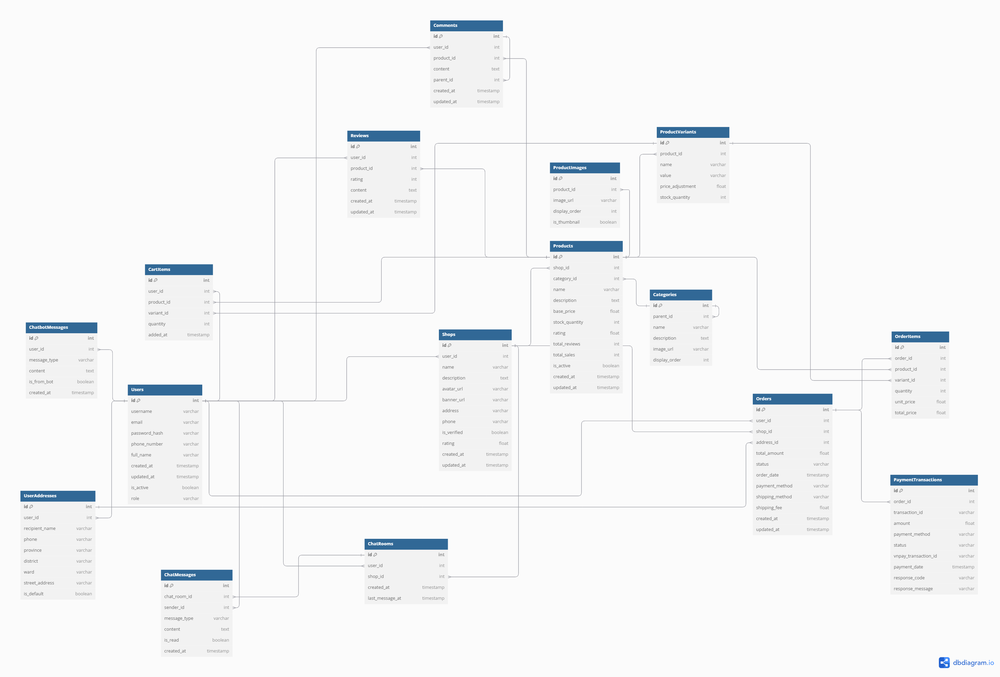

# VieShop
Shopee clone with Chatbot

# Database

Giải thích chi tiết về schema database:

1. Users (Người dùng):
- Lưu thông tin cơ bản của người dùng
- Có role để phân biệt quyền hạn (user thường/shop owner/admin)
- Liên kết với nhiều bảng khác qua khóa ngoại

2. Shops (Cửa hàng):
- Thuộc về một user (user_id)
- Lưu thông tin cửa hàng, rating, địa chỉ
- Có thể verify shop (is_verified) để tăng độ tin cậy

3. Products (Sản phẩm):
- Thuộc về một shop
- Có category phân loại
- Lưu thông tin cơ bản về sản phẩm
- Có rating và số lượng review tổng hợp

4. ProductImages & ProductVariants:
- ProductImages: Lưu nhiều ảnh cho một sản phẩm
- ProductVariants: Lưu các biến thể của sản phẩm (size, màu, etc.)

5. Orders & OrderItems (Đơn hàng):
- Orders: Thông tin đơn hàng tổng
- OrderItems: Chi tiết từng sản phẩm trong đơn
- Liên kết với PaymentTransactions để xử lý thanh toán

6. PaymentTransactions:
- Lưu thông tin giao dịch thanh toán
- Tích hợp với VNPay (vnpay_transaction_id)
- Theo dõi trạng thái thanh toán

7. Reviews & Comments:
- Reviews: Đánh giá sao và nội dung review
- Comments: Bình luận trên sản phẩm, có thể reply (parent_id)

8. ChatRooms & ChatMessages:
- ChatRooms: Phòng chat giữa user và shop
- ChatMessages: Lưu tin nhắn trong phòng chat
- ChatbotMessages: Lưu tin nhắn chat với bot riêng

9. CartItems:
- Giỏ hàng của user
- Lưu sản phẩm và số lượng

10. UserAddresses:
- Lưu nhiều địa chỉ của user
- Có thể đánh dấu địa chỉ mặc định

Các tính năng chính được hỗ trợ:
1. Mua hàng:
- Thêm vào giỏ hàng (CartItems)
- Tạo đơn hàng (Orders, OrderItems)
- Thanh toán qua VNPay (PaymentTransactions)

2. Bán hàng:
- Đăng ký shop (Shops)
- Quản lý sản phẩm (Products, ProductVariants)
- Xử lý đơn hàng (Orders)

3. Tương tác:
- Chat với người bán (ChatRooms, ChatMessages)
- Chat với bot (ChatbotMessages)
- Review và comment (Reviews, Comments)

4. Quản lý sản phẩm:
- Nhiều hình ảnh (ProductImages)
- Biến thể sản phẩm (ProductVariants)
- Phân loại (Categories)
